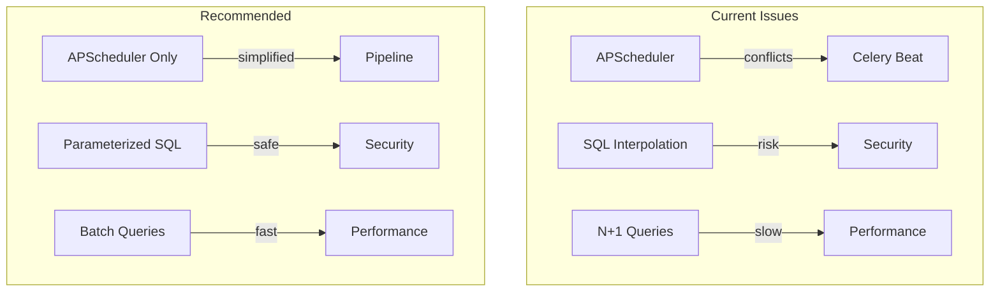
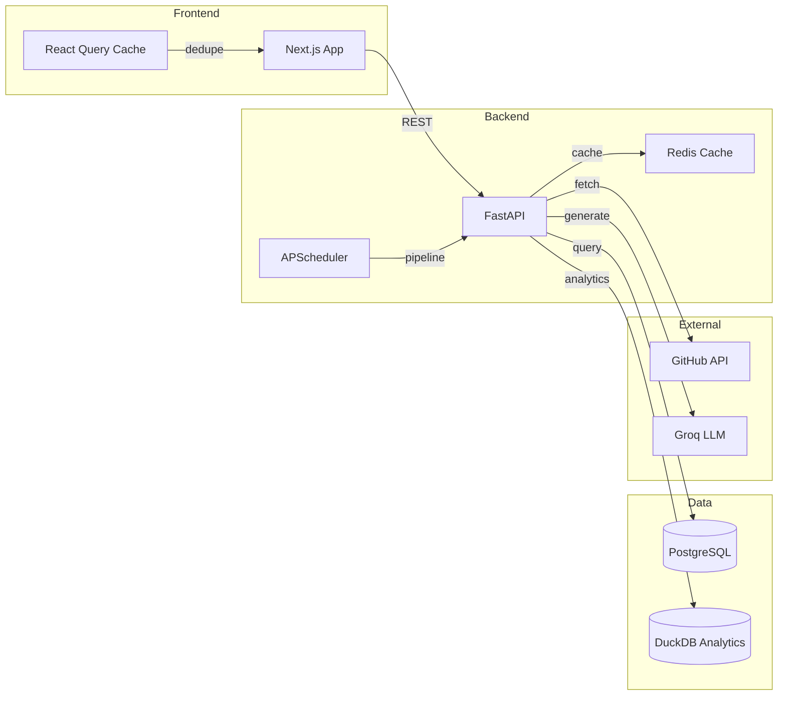

# Repodar Codebase Review: Issues, Anomalies & Enhancement Plan

## Executive Summary

This document provides a comprehensive review of the Repodar codebase, identifying **5 critical issues**, **12 high-priority enhancements**, **8 medium-priority improvements**, and **6 technical debt items**. The codebase is well-structured overall with good separation of concerns, but has several areas requiring attention for production robustness.

---

## Critical Issues (Immediate Action Required)

### 1. Duplicate Code in Celery Worker (CRITICAL)

**File:** `backend/app/celery_worker.py`

**Problem:** Lines 189-334 contain a near-duplicate of lines 1-187. This appears to be accidental code duplication where:
- Celery app is defined twice (lines 32-50 and 205-223)
- Task definitions appear twice with slightly different configurations
- Beat schedules conflict with each other

**Impact:**
- Python will use the second definition, overriding the first
- The beat schedule in lines 227-243 overrides the one in lines 55-68
- `task_pipeline_sync` defined in lines 79-111 is completely overwritten
- Confusion about which scheduler configuration is active

**Fix:**
```python
# Remove lines 189-334 entirely, keeping only the intended version
# OR merge the two versions if different functionality is needed
```

---

### 2. SQL Injection Vulnerability in DuckDB Queries (CRITICAL)

**File:** `backend/app/services/scoring.py` (lines 76-96, 435-451)

**Problem:** String interpolation is used in DuckDB SQL queries:
```python
df = conn.execute(f"""
    SELECT ... FROM repodar.daily_metrics
    WHERE repo_id = '{repo_id}'
      AND DATE(captured_at) >= '{cutoff}'
""").fetchdf()
```

**Impact:** If `repo_id` contains malicious SQL, it could be executed.

**Fix:**
```python
# Use parameterized queries
df = conn.execute(
    "SELECT ... FROM repodar.daily_metrics WHERE repo_id = ? AND DATE(captured_at) >= ?",
    [repo_id, cutoff]
).fetchdf()
```

---

### 3. Unprotected Admin Endpoints (CRITICAL)

**File:** `backend/app/routers/admin.py` (line 3-4)

**Problem:** Admin endpoints are explicitly unprotected:
```python
"""
Admin endpoints — development-only triggers for manual pipeline runs.
These are not protected in v1 (no auth). Add API key middleware before exposing publicly.
"""
```

**Impact:** Anyone can trigger:
- Full pipeline runs (`/admin/run-all-sync`)
- Database seeding
- GitHub API status checks

**Fix:**
```python
# Add authentication middleware for admin routes
from app.middleware import AdminAuthMiddleware

# Or require API key for admin endpoints
@router.post("/run-all-sync", dependencies=[Depends(require_admin_key)])
```

---

### 4. Dual Scheduling System Conflict (CRITICAL)

**Files:** `backend/app/main.py` (APScheduler) and `backend/app/celery_worker.py` (Celery Beat)

**Problem:** Two scheduling systems are configured:
1. APScheduler in `main.py` - runs pipeline every 4 hours
2. Celery Beat in `celery_worker.py` - also configured for daily tasks

**Impact:**
- If both are running, tasks execute twice
- If only APScheduler is used (as stated in README), Celery worker is dead code
- Resource waste and potential data corruption from concurrent runs

**Fix:**
```python
# Option A: Remove Celery entirely (recommended per README)
# - Delete celery_worker.py
# - Remove celery/redis dependencies from requirements.txt

# Option B: Use only Celery, remove APScheduler
# - Remove _schedule_pipeline() from main.py
# - Run separate worker process
```

---

### 5. N+1 Query Problem in Repos List (HIGH)

**File:** `backend/app/routers/repositories.py` (lines 56-104)

**Problem:**
```python
for repo in repos:
    latest_cm = (
        db.query(ComputedMetric)
        .filter_by(repo_id=repo.id)
        .order_by(ComputedMetric.date.desc())
        .first()
    )
```

**Impact:** For 100 repos, this makes 101 database queries instead of 1-2.

**Fix:**
```python
# Use a single query with window functions or joins
from sqlalchemy.orm import joinedload
from sqlalchemy import func

# Option 1: Subquery for latest metrics per repo
latest_cm_subq = (
    db.query(
        ComputedMetric.repo_id,
        func.max(ComputedMetric.date).label('max_date')
    )
    .group_by(ComputedMetric.repo_id)
    .subquery()
)

results = (
    db.query(Repository, ComputedMetric)
    .outerjoin(ComputedMetric, 
        and_(
            Repository.id == ComputedMetric.repo_id,
            ComputedMetric.date == latest_cm_subq.c.max_date
        )
    )
    .all()
)
```

---

## High-Priority Enhancements

### 6. Add Missing Database Indexes

**Files:** `backend/app/models/*.py`

**Problem:** High-traffic queries may lack indexes on frequently filtered columns.

**Recommendation:**
```python
# In Repository model
__table_args__ = (
    Index('ix_repositories_owner_name', 'owner', 'name', unique=True),
    Index('ix_repositories_source_active', 'source', 'is_active'),
)

# In DailyMetric model
__table_args__ = (
    Index('ix_daily_metrics_repo_date', 'repo_id', 'captured_at'),
)

# In ComputedMetric model
__table_args__ = (
    Index('ix_computed_metrics_repo_date', 'repo_id', 'date'),
)
```

---

### 7. Implement Proper Pagination

**File:** `backend/app/routers/repositories.py`

**Problem:** `list_repos` uses `limit` but no `offset`, making true pagination impossible.

**Fix:**
```python
@router.get("", response_model=PaginatedResponse[RepoSummary])
def list_repos(
    category: Optional[str] = None,
    sort_by: str = "trend_score",
    page: int = Query(1, ge=1),
    per_page: int = Query(50, le=200),
    db: Session = Depends(get_db),
):
    offset = (page - 1) * per_page
    # ... query with offset and total count
```

---

### 8. Add API Response Caching

**Problem:** Frequently accessed endpoints (overview, leaderboard) query the database on every request.

**Recommendation:**
```python
# Use Redis for caching (already in requirements)
from redis import Redis
from functools import wraps
import json

redis = Redis.from_url(os.getenv("REDIS_URL"))

def cache_response(ttl_seconds: int):
    def decorator(func):
        @wraps(func)
        async def wrapper(*args, **kwargs):
            cache_key = f"{func.__name__}:{hash(str(args) + str(kwargs))}"
            cached = redis.get(cache_key)
            if cached:
                return json.loads(cached)
            result = await func(*args, **kwargs)
            redis.setex(cache_key, ttl_seconds, json.dumps(result))
            return result
        return wrapper
    return decorator

# Apply to expensive endpoints
@router.get("/overview")
@cache_response(ttl_seconds=300)  # 5 minutes
async def get_overview():
    ...
```

---

### 9. Frontend Error Boundaries

**Problem:** React components lack error boundaries for graceful error handling.

**Recommendation:**
```typescript
// components/ErrorBoundary.tsx
"use client";

import { Component, ReactNode } from "react";

interface Props {
  children: ReactNode;
  fallback?: ReactNode;
}

interface State {
  hasError: boolean;
  error?: Error;
}

export class ErrorBoundary extends Component<Props, State> {
  state = { hasError: false, error: undefined };

  static getDerivedStateFromError(error: Error) {
    return { hasError: true, error };
  }

  render() {
    if (this.state.hasError) {
      return this.props.fallback || (
        <div className="p-8 text-center">
          <h2>Something went wrong</h2>
          <button onClick={() => this.setState({ hasError: false })}>
            Try again
          </button>
        </div>
      );
    }
    return this.props.children;
  }
}

// Wrap pages in layout.tsx
<ErrorBoundary>
  <AppShell>{children}</AppShell>
</ErrorBoundary>
```

---

### 10. Add Frontend API Retry Logic

**File:** `frontend/lib/api.ts`

**Problem:** No retry mechanism for transient network failures.

**Fix:**
```typescript
async function apiFetch<T>(
  path: string,
  options?: RequestInit,
  retries: number = 3
): Promise<T> {
  try {
    const res = await fetch(`${BASE}${path}`, {
      ...options,
      headers: {
        "Content-Type": "application/json",
        ...(options?.headers as Record<string, string> | undefined),
      },
    });
    
    if (!res.ok) {
      // Retry on 5xx errors
      if (res.status >= 500 && retries > 0) {
        await new Promise(r => setTimeout(r, 1000 * (4 - retries)));
        return apiFetch<T>(path, options, retries - 1);
      }
      // ... existing error handling
    }
    return res.json();
  } catch (error) {
    if (retries > 0) {
      await new Promise(r => setTimeout(r, 1000 * (4 - retries)));
      return apiFetch<T>(path, options, retries - 1);
    }
    throw error;
  }
}
```

---

### 11. Configure Next.js Properly

**File:** `frontend/next.config.ts`

**Problem:** Empty configuration missing important optimizations.

**Fix:**
```typescript
import type { NextConfig } from "next";

const nextConfig: NextConfig = {
  // Security headers
  async headers() {
    return [
      {
        source: "/:path*",
        headers: [
          { key: "X-Frame-Options", value: "DENY" },
          { key: "X-Content-Type-Options", value: "nosniff" },
          { key: "Referrer-Policy", value: "strict-origin-when-cross-origin" },
        ],
      },
    ];
  },
  
  // Image optimization
  images: {
    remotePatterns: [
      { hostname: "avatars.githubusercontent.com" },
      { hostname: "*.githubusercontent.com" },
    ],
  },
  
  // Enable strict mode
  reactStrictMode: true,
  
  // Optimize bundle
  experimental: {
    optimizePackageImports: ["recharts", "@tanstack/react-query"],
  },
};

export default nextConfig;
```

---

### 12. Add Request Logging and Tracing

**Problem:** No structured request logging for debugging and monitoring.

**Recommendation:**
```python
# middleware/request_logger.py
import time
import uuid
from starlette.middleware.base import BaseHTTPMiddleware

class RequestLoggerMiddleware(BaseHTTPMiddleware):
    async def dispatch(self, request, call_next):
        request_id = str(uuid.uuid4())[:8]
        request.state.request_id = request_id
        
        start_time = time.time()
        response = await call_next(request)
        duration = time.time() - start_time
        
        logger.info(
            "request",
            extra={
                "request_id": request_id,
                "method": request.method,
                "path": request.url.path,
                "status": response.status_code,
                "duration_ms": round(duration * 1000, 2),
            }
        )
        
        response.headers["X-Request-ID"] = request_id
        return response
```

---

### 13. Add Health Check with Dependencies

**File:** `backend/app/main.py`

**Problem:** Basic health check doesn't verify database connectivity.

**Fix:**
```python
from pydantic import BaseModel

class HealthStatus(BaseModel):
    status: str
    database: str
    redis: str | None
    github_api: str

@app.get("/health", response_model=HealthStatus)
def health_check(db: Session = Depends(get_db)):
    # Check database
    try:
        db.execute(text("SELECT 1"))
        db_status = "healthy"
    except Exception as e:
        db_status = f"unhealthy: {e}"
    
    # Check Redis (optional)
    redis_status = "not_configured"
    if os.getenv("REDIS_URL"):
        try:
            redis = Redis.from_url(os.getenv("REDIS_URL"))
            redis.ping()
            redis_status = "healthy"
        except Exception as e:
            redis_status = f"unhealthy: {e}"
    
    return HealthStatus(
        status="ok" if db_status == "healthy" else "degraded",
        database=db_status,
        redis=redis_status,
        github_api="configured" if os.getenv("GITHUB_TOKEN") else "not_configured"
    )
```

---

### 14. Add CORS Configuration for Production

**File:** `backend/app/main.py`

**Problem:** CORS allows all methods and headers.

**Fix:**
```python
app.add_middleware(
    CORSMiddleware,
    allow_origins=[
        "http://localhost:3000",
        "https://repodar.vercel.app",
        "https://repodar.up.railway.app",
        "https://repodar.io",
    ],
    allow_credentials=True,
    allow_methods=["GET", "POST", "PUT", "DELETE", "PATCH", "OPTIONS"],
    allow_headers=[
        "Content-Type",
        "Authorization",
        "X-API-Key",
        "X-Request-ID",
    ],
    expose_headers=["X-Request-ID", "X-RateLimit-Limit", "X-RateLimit-Remaining"],
    max_age=600,  # Cache preflight for 10 minutes
)
```

---

### 15. Add Input Validation for Search Queries

**File:** `backend/app/routers/repositories.py`

**Problem:** User input (repo_id, owner, name) is not sanitized before use.

**Fix:**
```python
import re

def validate_repo_slug(slug: str) -> tuple[str, str]:
    """Validate and parse owner/name slug."""
    if not re.match(r'^[a-zA-Z0-9_-]+/[a-zA-Z0-9_.-]+$', slug):
        raise HTTPException(
            status_code=400,
            detail="Invalid repository format. Use 'owner/name' with alphanumeric characters."
        )
    owner, name = slug.split("/", 1)
    if len(owner) > 39 or len(name) > 100:
        raise HTTPException(status_code=400, detail="Owner or name too long")
    return owner, name
```

---

### 16. Add Database Connection Pooling Configuration

**File:** `backend/app/database.py`

**Problem:** Pool settings may not be optimal for production load.

**Current:** pool_size=10, max_overflow=20

**Recommendation:** Make configurable and add pool events:
```python
from sqlalchemy import event
import logging

pool_logger = logging.getLogger("db.pool")

@event.listens_for(engine, "checkout")
def on_checkout(dbapi_conn, connection_record, connection_proxy):
    pool_logger.debug(f"Connection checkout: {id(dbapi_conn)}")

@event.listens_for(engine, "checkin")
def on_checkin(dbapi_conn, connection_record):
    pool_logger.debug(f"Connection checkin: {id(dbapi_conn)}")

# Environment-based configuration
pool_size = int(os.getenv("DB_POOL_SIZE", "10"))
max_overflow = int(os.getenv("DB_MAX_OVERFLOW", "20"))
```

---

### 17. Add Graceful Shutdown Handling

**File:** `backend/app/main.py`

**Problem:** Shutdown may interrupt in-flight requests.

**Fix:**
```python
import signal
import asyncio

shutdown_event = asyncio.Event()

@asynccontextmanager
async def lifespan(app: FastAPI):
    # ... existing startup code ...
    
    # Setup signal handlers
    def handle_shutdown(signum, frame):
        logger.info("Shutdown signal received, draining connections...")
        shutdown_event.set()
    
    signal.signal(signal.SIGTERM, handle_shutdown)
    signal.signal(signal.SIGINT, handle_shutdown)
    
    yield
    
    # Wait for in-flight requests (max 30 seconds)
    logger.info("Waiting for in-flight requests to complete...")
    await asyncio.wait_for(shutdown_event.wait(), timeout=30.0)
    
    # ... existing shutdown code ...
```

---

## Medium-Priority Improvements

### 18. Extract Configuration to Pydantic Settings

**Problem:** Configuration scattered across files using `os.getenv()`.

**Recommendation:**
```python
# config.py
from pydantic_settings import BaseSettings

class Settings(BaseSettings):
    # GitHub
    github_token: str
    github_api_version: str = "2022-11-28"
    
    # Database
    database_url: str
    db_pool_size: int = 10
    db_max_overflow: int = 20
    
    # Redis
    redis_url: str = "redis://localhost:6379/0"
    
    # Groq
    groq_api_key: str = ""
    groq_model: str = "llama-3.3-70b-versatile"
    
    # App
    app_env: str = "development"
    log_level: str = "INFO"
    
    # Scheduler
    stale_days: int = 60
    pipeline_interval_hours: int = 4
    
    class Config:
        env_file = ".env"
        env_file_encoding = "utf-8"

settings = Settings()
```

---

### 19. Refactor Large Service Files

**Files:**
- `backend/app/services/scoring.py` (992 lines)
- `backend/app/services/github_search.py` (1158 lines)
- `backend/app/services/ingestion.py` (531 lines)

**Recommendation:** Split into focused modules:
```
services/
├── scoring/
│   ├── __init__.py
│   ├── signals.py          # Individual signal calculations
│   ├── composer.py         # Composite score composition
│   ├── alerts.py           # Alert detection
│   └── category.py         # Category growth computations
├── github/
│   ├── __init__.py
│   ├── client.py           # GraphQL/REST client
│   ├── search.py           # Search API
│   └── trending.py         # Trending scraper
└── ingestion/
    ├── __init__.py
    ├── discovery.py        # Auto-discovery
    ├── metrics.py          # Daily metrics ingestion
    └── enrichment.py       # Contributor/fork enrichment
```

---

### 20. Add Comprehensive Test Coverage

**Current State:**
- Only 2 test files: `test_ingestion.py`, `test_scoring.py`
- No router tests
- No frontend tests

**Recommendation:**
```
backend/tests/
├── conftest.py
├── unit/
│   ├── test_signals.py
│   ├── test_scoring.py
│   └── test_github_client.py
├── integration/
│   ├── test_ingestion.py
│   ├── test_routers.py
│   └── test_api.py
└── e2e/
    └── test_pipeline.py

frontend/__tests__/
├── components/
│   └── Sidebar.test.tsx
├── lib/
│   └── api.test.ts
└── hooks/
    └── useRepoData.test.ts
```

---

### 21. Add OpenAPI Schema Enhancements

**File:** `backend/app/main.py`

**Recommendation:**
```python
app = FastAPI(
    title="Repodar",
    description="...",
    version="1.0.0",
    docs_url="/docs",
    redoc_url="/redoc",
    openapi_tags=[
        {"name": "Repositories", "description": "GitHub repository data"},
        {"name": "Metrics", "description": "Daily and computed metrics"},
        {"name": "Dashboard", "description": "Aggregated dashboard views"},
        {"name": "Admin", "description": "Administrative operations"},
    ],
    openapi_url="/openapi.json",
    servers=[
        {"url": "http://localhost:8000", "description": "Development"},
        {"url": "https://repodar.up.railway.app", "description": "Production"},
    ],
)
```

---

### 22. Add Structured Logging

**Problem:** Logging uses basic string formatting.

**Recommendation:**
```python
import structlog

structlog.configure(
    processors=[
        structlog.contextvars.merge_contextvars,
        structlog.processors.add_log_level,
        structlog.processors.TimeStamper(fmt="iso"),
        structlog.processors.JSONRenderer() if os.getenv("APP_ENV") == "production" 
            else structlog.dev.ConsoleRenderer(),
    ],
    wrapper_class=structlog.make_filtering_bound_logger(logging.INFO),
)

logger = structlog.get_logger()

# Usage
logger.info("pipeline_started", repos_count=len(repos), run_id=run_id)
```

---

### 23. Add API Versioning Strategy

**Problem:** Internal routes lack versioning.

**Recommendation:**
```python
# Current: /repos, /dashboard, etc.
# Future: /api/v2/repos, /api/v2/dashboard

from fastapi import APIRouter

api_v1 = APIRouter(prefix="/api/v1")
api_v2 = APIRouter(prefix="/api/v2")

# Version-specific implementations
app.include_router(api_v1)
app.include_router(api_v2)

# Deprecation headers
@router.get("/legacy-endpoint")
async def legacy(response: Response):
    response.headers["Deprecation"] = "true"
    response.headers["Sunset"] = "Sat, 01 Jan 2027 00:00:00 GMT"
    ...
```

---

### 24. Add Request Rate Limiting for Non-API Routes

**Problem:** Only `/api/v1/*` has rate limiting via API keys.

**Recommendation:**
```python
from slowapi import Limiter
from slowapi.util import get_remote_address

limiter = Limiter(key_func=get_remote_address)

@app.get("/dashboard/overview")
@limiter.limit("60/minute")
async def overview(request: Request):
    ...
```

---

### 25. Add Data Validation for External APIs

**Problem:** GitHub API responses are used without schema validation.

**Recommendation:**
```python
from pydantic import BaseModel, Field

class GitHubRepoResponse(BaseModel):
    id: int
    name: str
    full_name: str
    owner: dict
    stargazers_count: int = Field(ge=0)
    forks_count: int = Field(ge=0)
    open_issues_count: int = Field(ge=0)
    language: str | None
    topics: list[str] = []
    
    class Config:
        extra = "ignore"  # Ignore unknown fields

# Usage
data = await resp.json()
validated = GitHubRepoResponse(**data)
```

---

## Technical Debt Items

### 26. Remove Dead Code

**Items to consider removing:**
- Celery worker if APScheduler is the primary scheduler
- Unused imports in various files
- Commented-out code blocks

---

### 27. Standardize Error Response Format

**Problem:** Error responses vary across endpoints.

**Recommendation:**
```python
from pydantic import BaseModel
from typing import Any

class ErrorResponse(BaseModel):
    error: str
    detail: str | None = None
    code: str
    context: dict[str, Any] | None = None

@router.get("/repos/{repo_id}")
async def get_repo(repo_id: str, db: Session = Depends(get_db)):
    repo = db.query(Repository).filter_by(id=repo_id).first()
    if not repo:
        raise HTTPException(
            status_code=404,
            detail=ErrorResponse(
                error="not_found",
                detail=f"Repository {repo_id} not found",
                code="REPO_NOT_FOUND",
            ).model_dump()
        )
```

---

### 28. Add Database Migration Rollback Scripts

**Problem:** Alembic migrations exist but rollback procedures aren't documented.

**Recommendation:**
```bash
# Add to Makefile
db-migrate:
    alembic upgrade head

db-rollback:
    alembic downgrade -1

db-rollback-all:
    alembic downgrade base

db-reset:
    alembic downgrade base && alembic upgrade head
```

---

### 29. Add Environment-Specific Configuration Files

**Recommendation:**
```
backend/
├── .env.example          # Template with all variables
├── .env.development      # Local dev defaults
├── .env.test             # Test environment
└── .env.production       # Production (not committed)
```

---

### 30. Document API Rate Limits

**Problem:** Rate limits are implemented but not documented in API responses.

**Recommendation:**
```python
@router.get("/api/v1/repos")
async def list_repos(request: Request, response: Response):
    response.headers["X-RateLimit-Limit"] = "1000"
    response.headers["X-RateLimit-Remaining"] = "999"
    response.headers["X-RateLimit-Reset"] = str(int(time.time()) + 3600)
    ...
```

---

### 31. Add Monitoring and Observability

**Recommendation:**
```python
# Add Prometheus metrics
from prometheus_fastapi_instrumentator import Instrumentator

Instrumentator().instrument(app).expose(app)

# Add OpenTelemetry tracing
from opentelemetry import trace
from opentelemetry.instrumentation.fastapi import FastAPIInstrumentor

FastAPIInstrumentor.instrument_app(app)
```

---

## Implementation Priority Matrix

| Priority | Issue | Effort | Impact | Recommended Sprint |
|----------|-------|--------|--------|-------------------|
| P0 | Duplicate Celery code | Low | Critical | Sprint 1 |
| P0 | SQL injection fix | Low | Critical | Sprint 1 |
| P0 | Admin auth | Medium | Critical | Sprint 1 |
| P0 | Scheduling conflict | Medium | Critical | Sprint 1 |
| P1 | N+1 queries | Medium | High | Sprint 1-2 |
| P1 | Database indexes | Low | High | Sprint 1 |
| P1 | Pagination | Low | High | Sprint 2 |
| P1 | Response caching | Medium | High | Sprint 2 |
| P1 | Error boundaries | Medium | High | Sprint 2 |
| P2 | API retry logic | Low | Medium | Sprint 2 |
| P2 | Next.js config | Low | Medium | Sprint 2 |
| P2 | Request logging | Medium | Medium | Sprint 3 |
| P2 | Health checks | Low | Medium | Sprint 3 |
| P2 | CORS hardening | Low | Medium | Sprint 3 |
| P2 | Input validation | Medium | Medium | Sprint 3 |
| P3 | Pydantic settings | Medium | Medium | Sprint 4 |
| P3 | Refactor services | High | Medium | Sprint 4-5 |
| P3 | Test coverage | High | Medium | Ongoing |
| P3 | Structured logging | Medium | Low | Sprint 4 |

---

## Architecture Recommendations

### Immediate Architecture Changes



### Target Architecture



---

## Summary Statistics

| Category | Count |
|----------|-------|
| Critical Issues | 5 |
| High-Priority Enhancements | 12 |
| Medium-Priority Improvements | 8 |
| Technical Debt Items | 6 |
| **Total Findings** | **31** |

### Files Requiring Changes

| File | Issues |
|------|--------|
| `backend/app/celery_worker.py` | Critical duplicate code |
| `backend/app/services/scoring.py` | SQL injection, large file |
| `backend/app/routers/admin.py` | Missing auth |
| `backend/app/routers/repositories.py` | N+1 queries, pagination |
| `backend/app/main.py` | Dual scheduling, CORS, shutdown |
| `backend/app/database.py` | Indexes, pooling |
| `frontend/next.config.ts` | Empty configuration |
| `frontend/lib/api.ts` | Missing retry logic |
| `frontend/components/*.tsx` | Missing error boundaries |

---

## Next Steps

1. **Review and prioritize** this plan with the team
2. **Sprint 1**: Address all P0 critical issues
3. **Sprint 2-3**: Implement high-priority enhancements
4. **Ongoing**: Add test coverage and refactor large files
5. **Review**: Re-assess technical debt after each sprint

This plan provides a roadmap for making Repodar more robust, secure, and maintainable while preserving its existing functionality.
