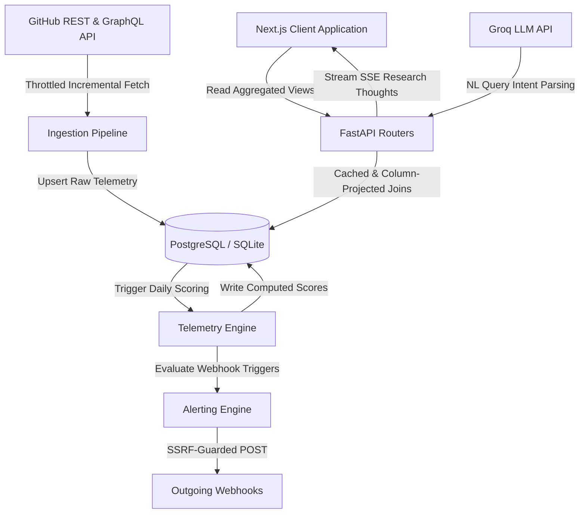

# 📡 Repodar: Telemetry Dashboard & AI Research Portal

Repodar is an open-source telemetry engine, agentic research workspace, and alerting pipeline designed to track GitHub repositories and identify high-growth "breakout" projects before they reach mainstream popularity. Unlike traditional trending lists that surface already-popular projects, Repodar analyzes short-term star velocity, commit frequency, growth acceleration, and repository sustainability to detect early momentum.

---

## ⚙️ Core Architecture & Pipeline



### 1. Ingestion Pipeline
* **Batch GraphQL Fetching:** To minimize API roundtrips and avoid rate-limiting, the ingestion pipeline chunks repository metadata fetching into batches of 15 using a single consolidated GraphQL query body. This retrieves stars, forks, watchers, open issues, pull requests, releases, primary language, and topic tags.
* **Incremental Delta commits:** Repositories carry a `last_fetched_at` cursor. Subsequent runs query the GitHub commits API with `?since=<cursor_timestamp>&per_page=1`. By utilizing the HTTP `Link` header pagination page count, the pipeline fetches the delta commit count without transferring the actual commit payload. This reduces commit tracking payload sizes by **80–90%**.
* **Throttled Concurrency:** API access is governed by local `asyncio.Semaphore` guards to protect TCP socket pools and stay within GitHub's secondary rate limits (GraphQL runs at `Semaphore(2)`, while Rest-heavy enrichment tasks run at `Semaphore(15)`).
* **REST Fallback:** If GraphQL requests time out or fail for a specific repository, the pipeline falls back to individual REST queries to maintain overall ingestion progress.

### 2. Agent-to-Agent (A2A) Capability Registry
Repodar includes a built-in discovery service that allows external AI agents to register their endpoints. This catalog normalizes capabilities across four distinct standards:
* **A2A Spec v1 (Google):** Maps high-level task types (skills) to routes, identifying input/output modes and streaming compatibility.
* **A2A Spec v0.3:** Integrates flat list objects containing `{name, method, path, description}` details.
* **OpenAI Plugin Manifests:** Ingests standard `.well-known/ai-plugin.json` formats, converting OpenAPI schemas into executable endpoints.
* **Model Context Protocol (MCP):** Auto-probes `/mcp` routes, mapping exposed tools, prompts, and resources into simulated `POST` paths.

**Validation and Security:**
* **SSRF Guard:** Webhook endpoints and registered A2A hostnames resolve their DNS entries via `socket.getaddrinfo`. IP targets are run through checks blocking private (`10.0.0.0/8`, `172.16.0.0/12`, `192.168.0.0/16`), loopback (`127.0.0.0/8`, `::1/128`), link-local (`169.254.0.0/16`), multicast, and reserved ranges to prevent Server-Side Request Forgery.
* **Heuristic Path Probing:** Registers services by probing up to 11 potential paths in priority order (e.g., `/.well-known/agent-card.json`, `/a2a-card`, `/mcp`). It classifies endpoints into state flags: `active`, `unreachable` (DNS/timeout), `auth_required` (401/403), `rate_limited` (429), `sleeping` (automatically retries after 3 seconds for cold-starts), or `invalid`.

---

## 🧮 Telemetry Mathematics

Repodar runs scoring calculations daily using two primary composite indices:

### 1. TrendScore (Momentum Indicator)
TrendScore measures a project's short-term growth trajectory (normalized from `0.0` to `1.0`). To prevent mature, high-baseline repositories from dominating the radar, the raw composite score is log-damped using the repository's age in days:

$$\text{TrendScore} = \min\left(1.0, \frac{\text{Score}_{\text{raw}}}{\ln(\max(\text{Age}_{\text{days}}, 2))}\right)$$

Where the raw component is a weighted sum of normalized telemetry signals:

$$\text{Score}_{\text{raw}} = 0.30 \cdot V_{7} + 0.20 \cdot A_{30} + 0.15 \cdot C_{\text{freq}} + 0.10 \cdot C_{\text{growth}} + 0.10 \cdot P_{\text{activity}} + 0.10 \cdot F_{\text{growth}} + 0.03 \cdot R_{\text{boost}} + 0.02 \cdot I_{\text{spike}}$$

* **$V_{7}$ (Star Velocity):** Trailing 7-day average stars gained per day, normalized against a baseline of 100 stars/day ($\min(1.0, \text{stars}/100)$).
* **$A_{30}$ (Star Acceleration):** The growth rate acceleration comparing the recent 7-day star rate to the prior 7-day rate, normalized against 50 stars/day ($\min(1.0, \max(0.0, \text{accel})/50)$).
* **$C_{\text{freq}}$ (Commit Frequency):** Normalized frequency of codebase updates on the default branch.
* **$C_{\text{growth}}$ (Contributor Growth):** Active code contributor percentage increase, normalized as $\min(1.0, \max(0.0, \text{growth\_rate}))$.
* **$P_{\text{activity}}$ (PR Activity):** Weighted code contribution score from merged pull requests.
* **$F_{\text{growth}}$ (Fork Growth):** Growth trajectory of downstream project splits.
* **$R_{\text{boost}}$ (Release Boost):** Binary indicator triggered by recent package releases/tags ($\text{value} \in \{0.0, 1.0\}$).
* **$I_{\text{spike}}$ (Issue Spike):** Normalized growth of unresolved issue threads.

### 2. SustainabilityScore (Health & Maintenance Proxy)
SustainabilityScore (ranging from `0.0` to `1.0`) evaluates whether a project is actively maintained or at risk of abandonment:

$$\text{SustainabilityScore} = 0.30 \cdot C_g + 0.30 \cdot I_c + 0.20 \cdot R_f + 0.20 \cdot F_s$$

* **$C_g$ (Contributor Growth Proxy):** Trailing contributor count growth, normalized as $\min(1.0, \max(0.0, \text{contributor\_growth\_rate} + 0.5))$.
* **$I_c$ (Issue Close Rate):** The ratio of resolved issues to total issues over a 30-day window.
* **$R_f$ (Release Frequency):** Frequency of releases over a 90-day lookup window, normalized and capped at 2 releases per week ($\min(1.0, \text{releases\_per\_week}/2)$).
* **$F_s$ (Fork-to-Star Ratio):** Ratio of forks to stars, scaled to reflect code integration relative to casual clicks ($\min(1.0, \text{fork\_to\_star} \cdot 5)$, capping at a 20% conversion rate).

**Health Classification Labels:**
* 🟢 **Jonin (Healthy):** $\text{Score} \ge 0.6$
* 🟡 **Chunin (Caution):** $0.3 \le \text{Score} < 0.6$
* 🔴 **Genin (Critical):** $\text{Score} < 0.3$

---

## ⚡ Database & Latency Tuning

Repodar uses a highly optimized data-access layer to deliver database query speeds of **< 2ms** on SQLite (and sub-millisecond on PostgreSQL):

1. **Direct Join Date Filtering:** Heavy partition scans (like `row_number() over (partition by repo_id order by date desc)`) are eliminated. Since repositories are scored synchronously, the database engine queries the scalar maximum date (`latest_date = max(ComputedMetric.date)`) once and performs a direct, index-friendly join (`ComputedMetric.date == latest_date`). This yields a **~6x database execution speedup**.
2. **SQL-Side Topic Filtering:** Keyword topic filtering is delegated to the database engine using SQL-side matching (`func.lower(Repository.topics).like(f'%"{topic}"%')`). This avoids pulling entire tables into Python memory for JSON parsing.
3. **ORM Bypass Projection Queries:** Read-heavy dashboard endpoints query specific tuple columns directly rather than parsing full SQLAlchemy ORM models. This bypasses SQLAlchemy instantiation, property tracking, and object graph construction overhead.
4. **N+1 Query Resolution:** Research session endpoints fetch messages, pins, reports, and shares concurrently using SQLAlchemy’s `selectinload` strategy, reducing database lookups from `3N + 1` down to exactly **4 queries**.
5. **Hierarchical Caching System:**
   * **Server-Side API Cache:** FastAPI routes use a memory-backed cache with a 5-minute TTL (`@cache(expire=300)`) for read-only telemetry and a 15-minute TTL (`@cache(expire=900)`) for weekly digests.
   * **Client-Side Self-Invalidating Cache:** The Next.js frontend cache (`sessionStorage`) stores GET request results for up to 2 minutes. When a mutation request (POST/PATCH/PUT/DELETE) is executed, the client automatically flushes all `repodar_api_cache:*` keys. This guarantees immediate interface updates following user actions (e.g. watchlist toggles or alert edits) while preventing redundant read lookups during page navigation.
   * **Client-Side Tab Pre-fetching:** On mounting the Radar page, TanStack React Query asynchronously pre-fetches adjacent sub-radar tabs (Breakout Radar and Early Insights) in the background.

---

## 🎨 Naruto Theme UX Micro-details

The frontend dashboard integrates several functional UI details themed around Naruto, implemented as self-contained vector SVGs and CSS variables in `globals.css`:

* **Sharingan Live Indicator:** A rotating 3-tomoe Sharingan symbol acting as a status-bar live pulse indicator.
* **Chakra Element Progress Fills:** Progress charts style repository categories using elemental colors: Fire (AI/ML), Lightning (Data/Infra), Wind (DevTools), Water (Web/Mobile), and Earth (Security).
* **Headband Signal Badges:** SVG priority markers styled as the Konoha Leaf (High Priority), Sand Gourd (Medium Priority), and Scratched Rogue Headband (Low Priority).
* **Ninja Rank Badges:** Displays repository health labels using custom Kanji badges: ANBU (Special), Jonin (Healthy), Chunin (Caution), and Genin (Critical).
* **Naruto Run Empty State:** An animated outline of a running ninja silhouette that handles empty tables and search lists.
* **Rasengan Typing Indicator:** Swirling concentric vector rings that spin in opposite directions to represent active AI reasoning states.
* **Konoha Leaf Brand Header:** The main sidebar brand header features a Konoha Leaf symbol that tilts 15 degrees and glows green on hover.
* **Substitution Shimmer:** High-priority cards play a border flash and radial shimmer animation on mouse hover, reflecting the substitution jutsu style.

---

## 🛠️ Local Setup

### 1. Prerequisites
Ensure you have the following installed:
* **Python 3.11+**
* **Node.js 20+**
* **GitHub Personal Access Token (PAT)**
* **Groq API Key**
* **Clerk Auth Keys**

---

### 2. Backend Service Installation

1. Navigate to the backend directory and create a virtual environment:
   ```bash
   cd backend
   python -m venv .venv
   source .venv/bin/activate
   pip install -r requirements.txt
   ```

2. Create a `backend/.env` file:
   ```env
   # API Keys
   GITHUB_TOKEN=your_github_personal_access_token
   GROQ_API_KEY=your_groq_api_key
   GROQ_MODEL=llama-3.3-70b-versatile

   # Database Settings
   DATABASE_URL=sqlite:///./repodar.db

   # CORS Configuration
   FRONTEND_URL=http://localhost:3000
   ```

3. Run database migrations:
   ```bash
   alembic upgrade head
   ```

4. Seed the database with initial metrics:
   ```bash
   curl -X POST http://localhost:8000/admin/run-all-sync
   ```

5. Start the FastAPI server:
   ```bash
   uvicorn app.main:app --reload --port 8000
   ```

---

### 3. Frontend Application Setup

1. Navigate to the frontend directory:
   ```bash
   cd ../frontend
   npm install
   ```

2. Copy the template variables and create `.env.local`:
   ```bash
   cp .env.example .env.local
   ```

3. Configure your Clerk keys and API URLs in `.env.local`:
   ```env
   # Authentication API Keys
   NEXT_PUBLIC_CLERK_PUBLISHABLE_KEY=pk_test_...
   CLERK_SECRET_KEY=sk_test_...

   # Redirect Options
   NEXT_PUBLIC_CLERK_SIGN_IN_URL=/sign-in
   NEXT_PUBLIC_CLERK_SIGN_UP_URL=/sign-up
   NEXT_PUBLIC_CLERK_AFTER_SIGN_IN_URL=/post-auth
   NEXT_PUBLIC_CLERK_AFTER_SIGN_UP_URL=/post-auth

   # Backend URL
   NEXT_PUBLIC_API_URL=http://localhost:8000
   ```

4. Start the Next.js development server:
   ```bash
   npm run dev
   ```
   Open **http://localhost:3000** in your browser.

---

## 📡 API Reference

Full interactive OpenAPI docs are available locally at `http://localhost:8000/docs`.

| Method | Endpoint | Description | Cache TTL |
| :--- | :--- | :--- | :--- |
| **GET** | `/dashboard/overview` | Core statistics, heatmaps, and breakout highlights. | 5m |
| **GET** | `/dashboard/radar` | Radar feed for high-acceleration breakouts. | 5m |
| **GET** | `/dashboard/early-radar` | Early-stage projects that are pre-viral. | 5m |
| **GET** | `/dashboard/leaderboard` | Period-based leaderboard across tech verticals. | 5m |
| **GET** | `/topics/momentum` | High-growth topics sorted by cumulative momentum weight. | 5m |
| **GET** | `/search?query=...` | Natural language query search engine. | 5m |
| **GET** | `/repos/{owner}/{name}` | Detailed metrics, commit heatmap, and AI summaries. | 5m |
| **GET** | `/snapshots/weekly` | Archive list of generated Weekly Snapshots. | 15m |
| **POST** | `/admin/run-all` | Triggers background ingestion, scoring, and analysis. | None |
| **POST** | `/admin/run-all-stream` | Runs ingestion and streams logs (falls back to background task if client lacks SSE). | None |
| **POST** | `/services/register` | Registers and validates an external A2A Service card. | None |

---

## 📄 License

Repodar is licensed under the **AGPL-3.0 License**.
